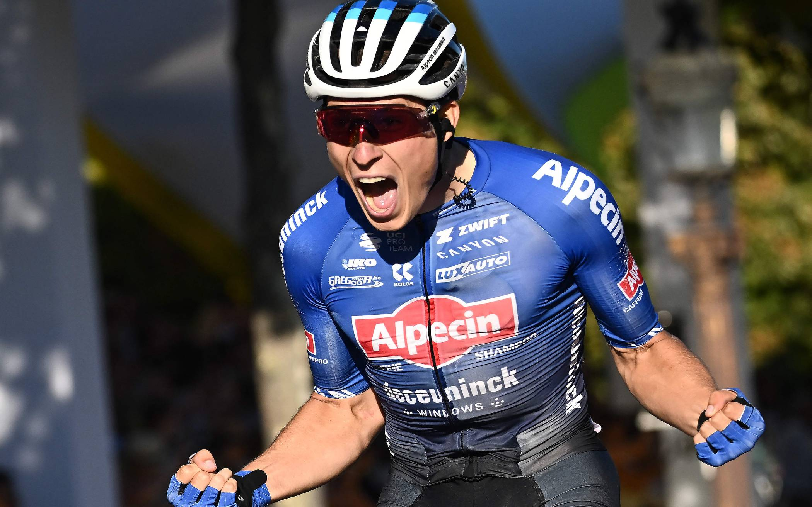
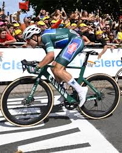
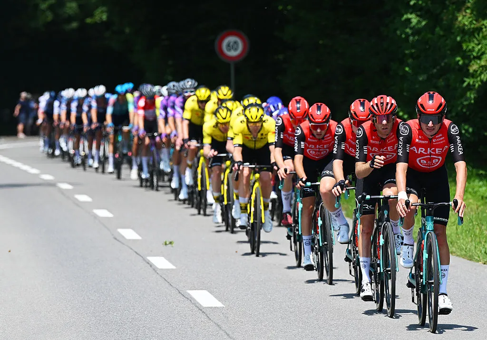
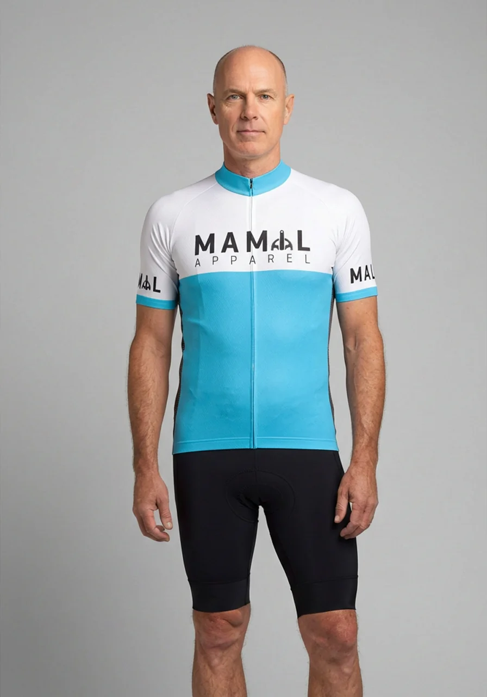
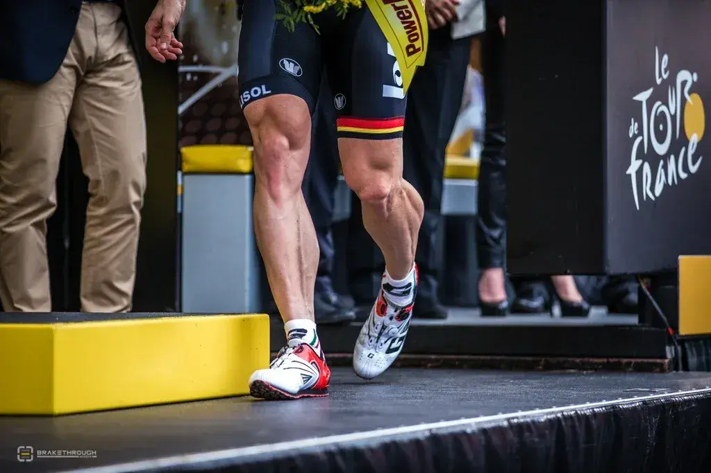
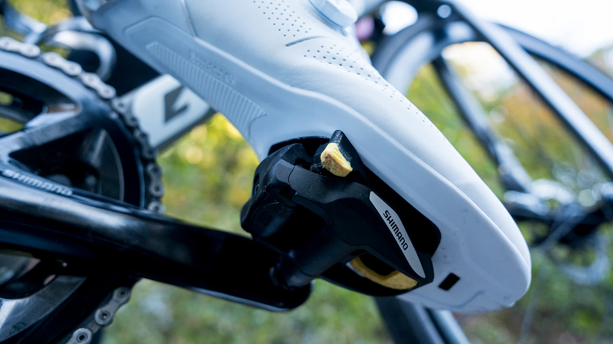
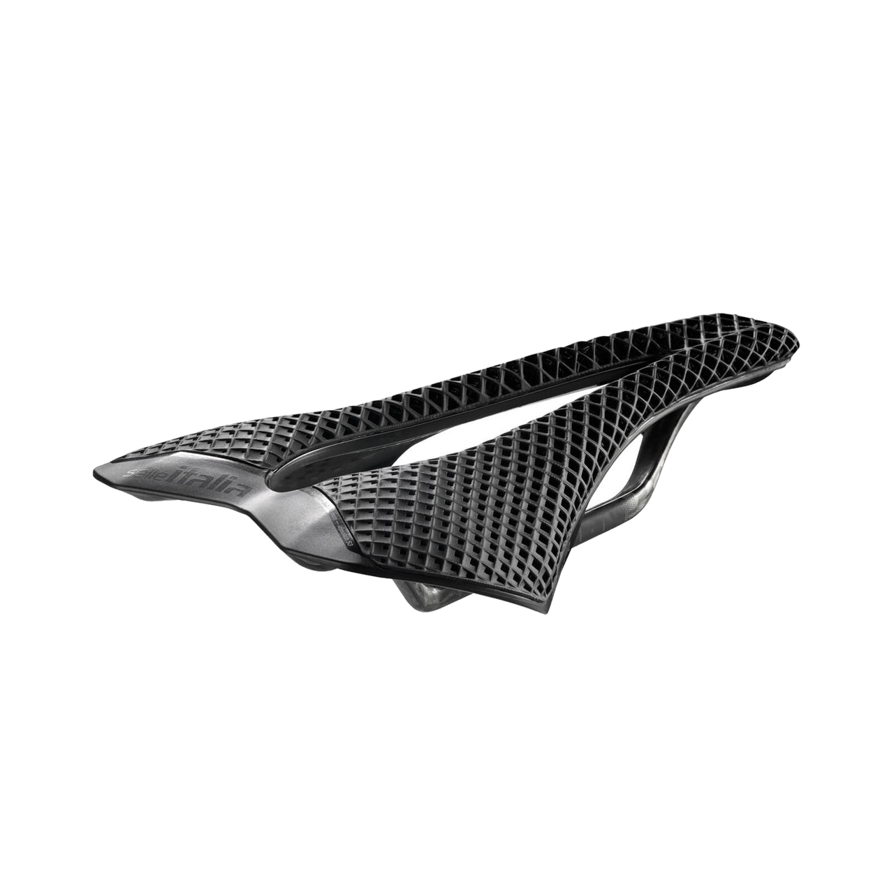
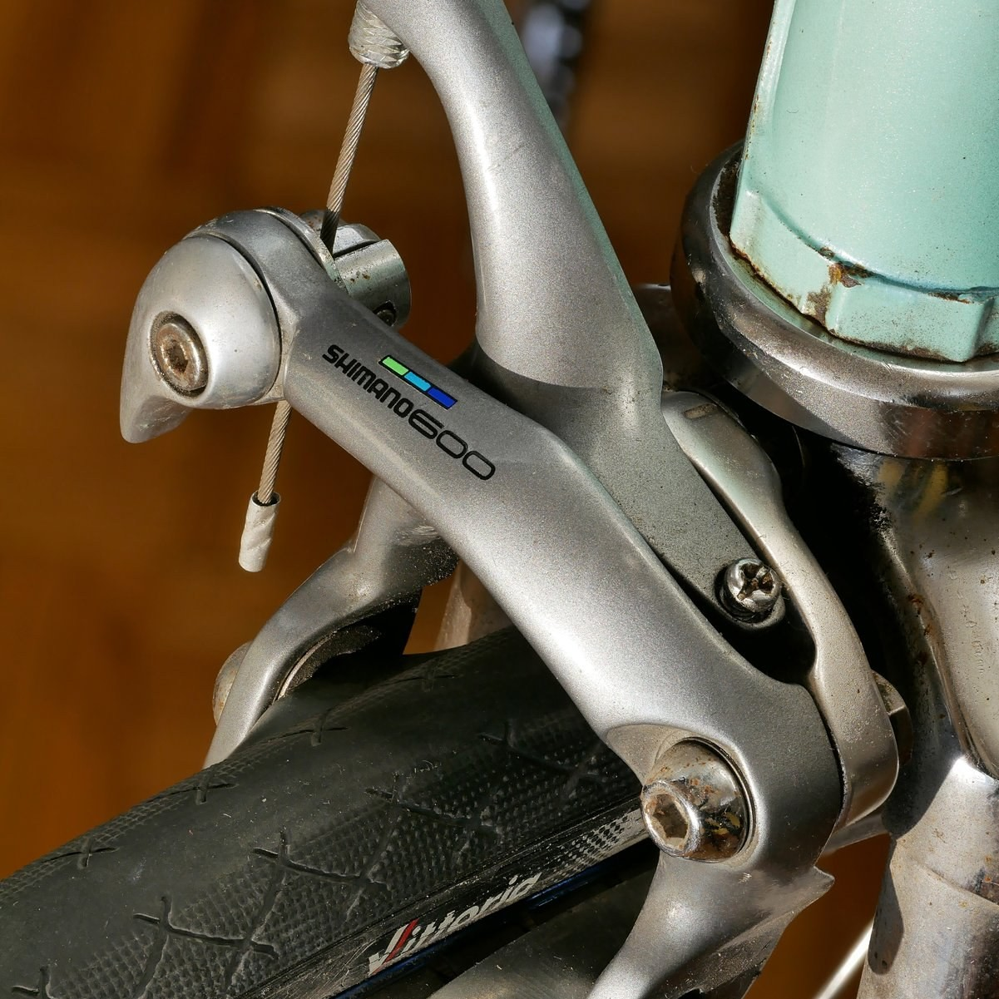
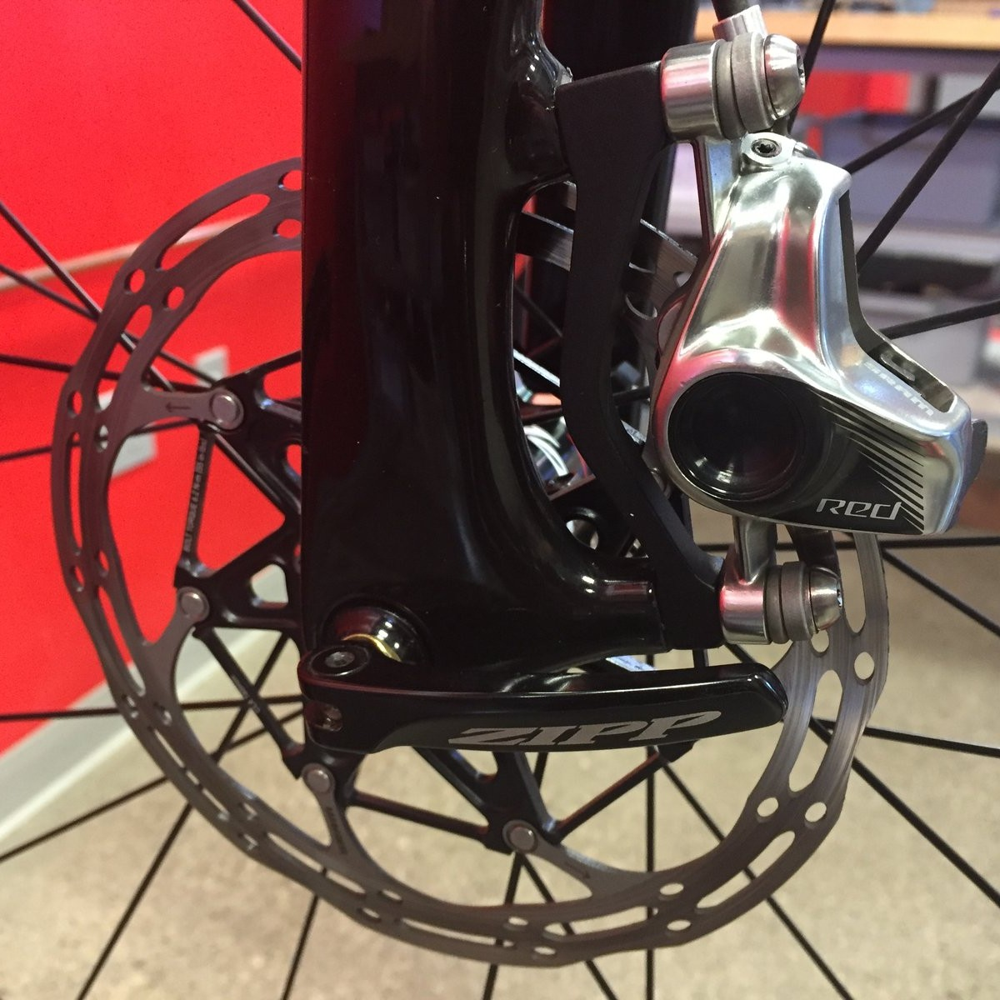

## Dmitry Mittov

:::: {.columns}
::: {.column width="60%" .vmiddle}
- GitHub: @dmittov
- E-mail: mittov@gmail.com
- Instagram: @mittov
- Strava: @dmittov
:::
::: {.column width="40%" .vmiddle}
{width="75%"}
:::
::::

## Двуногий против копытного
борьба за господство на дороге

:::: {.columns}
::: {.column width="75%" .text-sm}
::: {.fragment .fade-up}
Конь:

100км за коня 6-10 часов / годы подготовки.

Очень сильный конь 4:30-5:30 < 25км/ч
:::

 

::: {.fragment .fade-up}
Milan - San-Remo 2024 (16.03)

288км / 2550м набора высоты

Jasper Philipsen - 6h 14' 44" - 46км/ч
:::

 

::: {.fragment .fade-up}
Очень тренированному endurance коню нужно больше суток.

Элитный конь, почти фантастический результат: 15 часов. Есть существенные риски для здоровья.

Jasper Philipsen 20.03.2024 выигрывает Brugge–De Panne 198.9 км, средняя скорость >45км/ч
:::

:::
::: {.column width="25%"}

:::
::::

## Шоссейный велосипед

анатомия стремительного хищника

:::: {.columns}
::: {.column width="62%"}
{width="65%"}
:::
::: {.column width="38%" .text-sm}
::: {.fragment .fade-up}
Специальный руль
:::

::: {.fragment .fade-up}
Седло выше руля
:::

:::
::::

## Пелотон

законы жизни в стае

:::: {.columns}
::: {.column width="60%"}
{width="100%"}
:::
::: {.column width="40%" .text-sm}
::: {.fragment .fade-up}
Команда
:::

::: {.fragment .fade-up}
30% экономии в небольшой группе
:::

::: {.fragment .fade-up}
До 90% в центре пелотона

Blocken et al., 2018 — [Aerodynamic drag in cycling pelotons: New insights by CFD simulation and wind tunnel testing](https://www.sciencedirect.com/science/article/pii/S0167610518303751)
:::
:::
::::

## Стоимость

цена принадлежности к виду

::: {.fragment .fade-up}
- Самый дорогой pro вариант Pinarello Dogma F: 14'500€
:::

::: {.fragment .fade-up}
- Новый, бюджетный Canyon Endurace CF 7: 2'299€
:::

::: {.fragment .fade-up}
- eBay: 600 - 1'200€
:::

## Лайкра

вторая кожа Homo Lycra

:::: {.columns}
::: {.column width="40%"}
{width="75%"}
:::
::: {.column width="60%" .text-sm}
::: {.fragment .fade-up}
Jersey + Bibs: 70–150 € (бюджет) / 300–600 € (pro)
:::

::: {.fragment .fade-up}
Base layer: 0-15–30 € / 50–100 € (мериносовая шерсть)
:::

::: {.fragment .fade-up}
Перчатки + Носки: 15–50 + 0€ / 40–80 + 10-50€
:::

::: {.fragment .fade-up}
Велотуфли: 50–120 € / 150–400 €
:::

::: {.fragment .fade-up}
Очки: 20–100 € / 150–250 €
:::

::: {.fragment .fade-up}
Шлем: 40–80 € / 200–330 € (аэро)
:::

::: {.fragment .fade-up}
**Итого: 195–530 € / 900–1'800 €**
:::
:::
::::

## Ритуал бритья

тайный обряд посвящения в племя

## Контактные педали

симбиоз человека и машины

## Седло

орган страдания как эволюционное преимущество

:::: {.columns}
::: {.column width="45%"}
{width="100%"}
:::
::: {.column width="55%" .text-sm}
::: {.fragment .fade-up}
Узко и жесткое — под седалищные кости в наклонной посадке, а не под мягкие ткани.
Минимум набивки — толстый поролон продавливается и увеличивает давление на мягкие ткани
:::

::: {.fragment .fade-up}
Без пружин — жёсткая платформа = меньше потерь мощности при педалировании
:::

::: {.fragment .fade-up}
Вырез/канал по центру — снимает давление с полового нерва и сосудов
:::

::: {.fragment .fade-up}
Разные ширины — под индивидуальную ширину седалищных костей
:::

:::
::::

## Тормоза

инстинкт самосохранения и борьба с ним

:::: {.columns}
::: {.column width="50%"}
{width="70%"}

клещевой (rim brake)
:::
::: {.column width="50%"}
{width="70%"}

дисковый (disc brake)
:::
::::

## Dmitry Mittov

:::: {.columns}
::: {.column width="60%" .vmiddle}
- GitHub: @dmittov
- E-mail: mittov@gmail.com
- Instagram: @mittov
- Strava: @dmittov
:::
::: {.column width="40%" .vmiddle}
{width="75%"}
:::
::::
