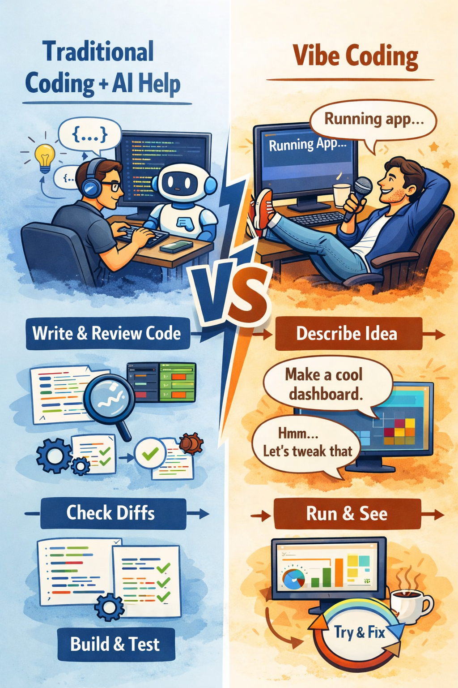
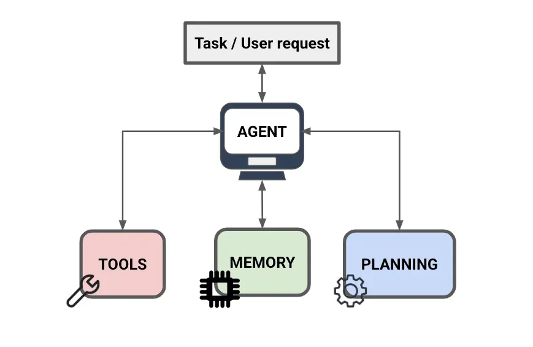

## Dmitry Mittov

- GitHub: @dmittov
- E-mail: mittov@gmail.com
- Company: Revolut

---

## Vibe coding != AI Assistant

<div class="list-small-text">
::: columns
::: column
* Traditional coding + AI help
  you write/own the architecture, review diffs, and use AI as an assistant.
* Vibe-coding
  you lean heavily on the model to produce most of the implementation, and you steer via prompts + quick feedback loops (run/test/fix) rather than line-by-line scrutiny.
:::
::: column
{style="max-height: 70vh; object-fit: contain;"}
:::
:::
</div>

---

## Focus & Goal

<div class="list-small-text">
* No debate whether vibe coding is “good” or “bad”.
* Take an LM as a black box, no LLM internals, no math.
* Know how to build a coding agent from scratch using LLM

It's a good guideline / check list to build agents for your practical tasks.
</div>

---

## Vibe Coding Tools

<div class="list-small-text">
* Claude Code
* Cursor AI
* OpenAI Codex
* ...
* Gemini CLI
* Qwen CLI
</div>

---

## Gemini CLI

<div class="list-small-text">
* Open Source: https://github.com/google-gemini/gemini-cli
* gemini-2.5-pro / gemini-3-pro are good enough
* Hides nothing, prompt processing is done inside a client's application
</div>

---

## System prompt

`src/core/prompts.ts`

```ts {.code-small-text}
"Analyse my application. Find all the security issues and fix them".length = 65 / 13
turn.chat.systemInstruction.length = 16335 / 3518 (250 times larger)
```

```markdown {.code-small-text}
You are an interactive CLI agent specializing in software engineering tasks.
Your primary goal is to help users safely and efficiently, adhering strictly to the following instructions 
and utilizing your available tools.

# Core Mandates

- **Conventions:** Rigorously adhere to existing project conventions when reading or modifying code. ...
- **Libraries/Frameworks:** NEVER assume a library/framework is available or appropriate. ...
...

# Primary Workflows

## Software Engineering Tasks
...
1. **Understand & Strategize:** Think about the user's request and the relevant codebase context. ...
2. **Plan:** Build a coherent and grounded ...
3. **Implement:** Use the available tools (e.g., '${EDIT_TOOL_NAME}', '${WRITE_FILE_TOOL_NAME}' ...
4. **Verify (Tests):** If applicable and feasible, verify the changes using the project's testing procedures ...
5. **Verify (Standards):** VERY IMPORTANT: After making code changes, execute the project-specific build, linting ...
...
## New Applications
...
```

---

## System prompt structure

<div class="list-small-text">
* Setup, Core Mandates, AGENTS.md / GEMINI.md
* Available Sub-Agents (codebase_investigator) & Tools
* Primary Workflows
  * Software Engineering Tasks
  * New Applications
* Operational Guidelines
  * Shell tool output token efficiency
  * Tone and Style (CLI Interaction)
  * Security and Safety Rules
  * Tool Usage
  * Interaction Details
* Sandbox info
* Git Repository
* Final Reminder
</div>

---

## Prompting

<div class="list-small-text">
<ul class="space-y-1">
  <li class="font-semibold text-emerald-600">LLM & settings</li>
  <li>General Prompt</li>
  <li>Prompt Techniques
    <ul class="mt-1 space-y-1">
      <li>Few-shot prompting [2020]</li>
      <li>Chain Of Thoughs [2022]</li>
      <li>RAG [2020]</li>
      <li>Structured Output [2024]</li>
      <li>ReAct [2023]</li>
    </ul>
  </li>
  <li>Tools / MCP [MCP: late 2024]</li>
  <li>Agent Memory / Compression</li>
  <li>Misc</li>
</ul>
</div>

---

## Prompting

<div class="list-small-text">
<ul class="space-y-1">
  <li class="opacity-40">LLM & settings</li>
  <li class="font-semibold text-emerald-600">General Prompt: set the task, be clear & explicit, focus on what should be done</li>
  <li>Prompt Techniques
    <ul class="mt-1 space-y-1">
      <li>Few-shot prompting [2020]</li>
      <li>Chain Of Thoughs [2022]</li>
      <li>RAG [2020]</li>
      <li>Structured Output [2024]</li>
      <li>ReAct [2023]</li>
    </ul>
  </li>
  <li>Tools / MCP [MCP: late 2024]</li>
  <li>Agent Memory / Compression</li>
  <li>Misc</li>
</ul>
</div>

---

## Prompting

<div class="list-small-text">
<ul class="space-y-1">
  <li class="opacity-40">LLM & settings</li>
  <li class="opacity-40">General Prompt</li>
  <li>Prompt Techniques
    <ul class="mt-1 space-y-1">
      <li class="font-semibold text-emerald-600">Few-shot prompting [2020]</li>
      <li>Chain Of Thoughs [2022]</li>
      <li>RAG [2020]</li>
      <li>Structured Output [2024]</li>
      <li>ReAct [2023]</li>
    </ul>
  </li>
  <li>Tools / MCP [MCP: late 2024]</li>
  <li>Agent Memory / Compression</li>
  <li>Misc</li>
</ul>
</div>

---

## Few-shot prompting

```{=html}
<div class="text-sm">
Is used in the final report in CodeInvestigator, prompt compressor, command output redirection.
</div>
<br/>

<div class="grid grid-cols-2 gap-6 items-start text-sm leading-snug">
  <div>
    <div class="text-xs uppercase opacity-60 mb-1">Standard Prompting</div>

Translate English to French:<br/><br/>
cheese =>

  </div>
  <div>
    <div class="text-xs uppercase opacity-60 mb-1">Few-shot Prompting</div>

Translate English to French:<br/><br/>
see otter => loutre de mer<br/><br/>
peppermint => menthe poivrée<br/><br/>
plush giraffe => girafe peluche<br/><br/>
cheese =>

  </div>

</div>
```

---

## Prompting

<div class="list-small-text">
<ul class="space-y-1">
  <li class="opacity-40">LLM & settings</li>
  <li class="opacity-40">General Prompt</li>
  <li>Prompt Techniques
    <ul class="mt-1 space-y-1">
      <li class="opacity-40">Few-shot prompting [2020]</li>
      <li class="font-semibold text-emerald-600">Chain Of Thoughs [2022]</li>
      <li>RAG [2020]</li>
      <li>Structured Output [2024]</li>
      <li>ReAct [2023]</li>
    </ul>
  </li>
  <li>Tools / MCP [MCP: late 2024]</li>
  <li>Agent Memory / Compression</li>
  <li>Misc</li>
</ul>
</div>

---

## Chain of Thoughts

```{=html}
Zero-shot CoT / Few-shot CoT
<div class="grid grid-cols-2 gap-6 items-start text-sm leading-snug">
  <div>
    <div class="text-xs uppercase opacity-60 mb-1">Few-Shot Prompting</div>

Q: Roger has 5 tennis balls. He buys 2 more cans of
tennis balls. Each can has 3 tennis balls. How many
tennis balls does he have now?
<br/><br/>
A: The answer is 11.
<br/><br/>
Q: The cafeteria had 23 apples. If they used 20 to
make lunch and bought 6 more, how many apples
do they have?
<br/><br/>
A: The answer is 27. <span class="text-red-500 font-bold">✗</span>
  </div>
  <div>
    <div class="text-xs uppercase opacity-60 mb-1">Chain Of Thoughts</div>

Q: Roger has 5 tennis balls. He buys 2 more cans of
tennis balls. Each can has 3 tennis balls. How many
tennis balls does he have now?
<br/><br/>
A: Roger started with 5 balls. 2 cans of 3 tennis balls
each is 6 tennis balls. 5 + 6 = 11. The answer is 11.
<br/><br/>
Q: The cafeteria had 23 apples. If they used 20 to
make lunch and bought 6 more, how many apples
do they have?
<br/><br/>
A: The cafeteria had 23 apples originally. They used
20 to make lunch. So they had 23 - 20 = 3. They
bought 6 more apples, so they have 3 + 6 = 9. The
answer is 9. <span class="text-green-500 font-bold">✓</span>
  </div>

</div>
```

---

## Prompting

<div class="list-small-text">
<ul class="space-y-1">
  <li>LLM & settings</li>
  <li class="opacity-40">General Prompt</li>
  <li>Prompt Techniques
    <ul class="mt-1 space-y-1">
      <li class="opacity-40">Few-shot prompting [2020]</li>
      <li class="opacity-40">Chain Of Thoughs [2022]</li>
      <li class="font-semibold text-emerald-600">RAG [2020]</li>
      <li>Structured Output [2024]</li>
      <li>ReAct [2023]</li>
    </ul>
  </li>
  <li>Tools / MCP [MCP: late 2024]</li>
  <li>Agent Memory / Compression</li>
  <li>Misc</li>
</ul>
</div>

---

## RAG: Retrieval-Augmented Generation

```{=html}
<div class="grid grid-cols-2 gap-6 items-start text-sm leading-snug">
  <div>
    <div class="text-xs uppercase opacity-60 mb-1">Standard Prompting</div>

Q: What exactly is written on the sign at the gates of Moria?<br/><br/>
A: A password is "Friend".

  </div>
  <div>
    <div class="text-xs uppercase opacity-60 mb-1">RAG Prompt</div>

Q: What exactly is written on the sign at the gates of Moria?<br/>
Use the genuine text from Context to answer the question.<br/><br/>
Context:<br/>
‘The words are in the elven-tongue of the West of Middle-earth
in the Elder Days,’ answered Gandalf. ‘But they do not say anything
of importance to us. They say only: The Doors of Durin, Lord of Moria.
Speak, friend, and enter. And underneath small and faint is written:
I, Narvi, made them. Celebrimbor of Hollin drew these signs.’
‘What does it mean by speak, friend, and enter?’ asked Merry...
<br/><br/>
A: From the provided Context, Gandalf reads the inscription as:
“The Doors of Durin, Lord of Moria. Speak, friend, and enter.”
And beneath it, in smaller, fainter writing:
“I, Narvi, made them. Celebrimbor of Hollin drew these signs.”

  </div>

</div>
```

---

## Prompting

<div class="list-small-text">
<ul class="space-y-1">
  <li class="opacity-40">LLM & settings</li>
  <li class="opacity-40">General Prompt</li>
  <li>Prompt Techniques
    <ul class="mt-1 space-y-1">
      <li class="opacity-40">Few-shot prompting [2020]</li>
      <li class="opacity-40">Chain Of Thoughs [2022]</li>
      <li class="opacity-40">RAG [2020]</li>
      <li class="font-semibold text-emerald-600">Structured Output [2024]</li>
      <li>ReAct [2023]</li>
    </ul>
  </li>
  <li>Tools / MCP [MCP: late 2024]</li>
  <li>Agent Memory / Compression</li>
  <li>Misc</li>
</ul>
</div>

---

## Structured Output

```{=html}
<div class="grid grid-cols-2 gap-6 items-start">
  <div>
  <div class="text-xs uppercase opacity-60 mb-1">Standard Prompt</div>

<div class="text-sm">
Q: ...
Your cards: Ah Qh
Board (flop): Kh 7d 2h
If you CALL, call amount is 6.
</div>
  </div>
  <div>
  <div class="text-xs uppercase opacity-60 mb-1">Standard Prompt + Output Format</div>

<div class="text-sm">
Q: ...
Your cards: Ah Qh
Board (flop): Kh 7d 2h
If you CALL, call amount is 6.
</div>

<pre>
<code class="sourceCode python"><span id="cb1-1"><span class="st text-sm">class Action(BaseModel):
  rationale_summary: str
  decision: Literal["FOLD", "CHECK", "BET", "RAISE"]
  amount: confloat(ge=6, le=100)

Action.model_json_schema()
</span></span>
</code>
</pre>

  </div>

  <div>

<div class="text-sm">
A: From A♥ Q♥ on K♥ 7♦ 2♥ (flop), there are 47 unseen cards and 1,081 possible turn+river combinations. Your final best 5-card hand by the river can be ... So, I decide to CALL (6)
</div>
  </div>
  <div>

<pre><code class="sourceCode json"><span id="cb1-1"><span class="st text-sm">{
  "rationale_summary": "From A♥ Q♥ on K♥ 7♦ 2♥ (flop), there are 47 unseen cards ..."
  "decision": "CALL",
  "amount": 6.0,
}
</span></span>
</code></pre>

  </div>
</div>
```

---

## Prompting

<div class="list-small-text">
<ul class="space-y-1">
  <li class="opacity-40">LLM & settings</li>
  <li class="opacity-40">General Prompt</li>
  <li>Prompt Techniques
    <ul class="mt-1 space-y-1">
      <li class="opacity-40">Few-shot prompting [2020]</li>
      <li class="opacity-40">Chain Of Thoughs [2022]</li>
      <li class="opacity-40">RAG [2020]</li>
      <li class="opacity-40">Structured Output [2024]</li>
      <li class="text-red-700">ReAct [2023]</li>
    </ul>
  </li>
  <li class="font-semibold text-emerald-600">Tools / MCP [MCP: late 2024]</li>
  <li>Agent Memory / Compression</li>
  <li>Misc</li>
</ul>
</div>

---

## LLM Query

There are libraries that proxy different APIs (i.e. litellm)

<div class="grid grid-cols-2 gap-6 items-start text-sm">
  <div>
    Raw Text

```markdown
Q: You are a smart Software Engineer.
Check the project and make a list of top code issues ...
```
  </div>
  <div>
    JSON API (OpenAI format v1/v2)

```json
{
  "role": "system",
  "content": "You are a smart Software Engineer."
},
{
  "role": "user",
  "content": "Check the project and make a list of ..."
}
```
  </div>

  <div>

```markdown
Ok, there is a single place where SQL injection is possible...
```
  </div>
  <div>

```json
{
  ...
  "content": [
    {
      "type": "output_text",
      "text": "Here is the patch ...",
      "annotations": []
    }
  ...
}
```
  </div>
</div>

---

## Tool calls

<div class="text-sm">
Generated text is a list of JSON messages. <br/>
Message types are:

* thought
* text
* functionCall

<br/>

```json
{
  "type": "functionCall",
  "name": "delegate_to_agent",
  "arguments": {
      "agent_name": "codebase_investigator",
      "objective": "Check the project and make a list of top code issues ..."
    }
}
```
</div>
---

## Gemini CLI Tools

<div class="text-sm">
Gemini CLI has 10 tools + CodeBase Investigator Sub-Agent

* google_web_search: Performs a web search using Google Search (via the Gemini API) and returns the results. This tool is useful for finding information on the internet based on a query.
* web_fetch: Processes content from URL(s), including local and private network addresses (e.g., localhost), embedded in a prompt. Include up to 20 URLs and instructions (e.g., summarize, extract specific data) directly in the 'prompt' parameter.
* read_file / write_file
* glob (aka FindFiles): Efficiently finds files matching specific glob patterns (e.g., `src/**/*.ts`, `**/*.md`), returning absolute paths sorted by modification time (newest first). Ideal for quickly locating files based on their name or path structure, especially in large codebases.
* run_shell_command
* delegate_to_agent: Delegates a task to a specialized sub-agent ...
</div>

---

## MCP

<div class="text-sm">
Anthropic introduced / open-sourced MCP on November 25, 2024.
[Specification, 2025-11-25](https://modelcontextprotocol.io/specification/2025-11-25)

JSON-RPC based protocol

Some tools may be executed somewhere else, be accessible by multiple agents.

Examples:

- [AWS Documentation](https://github.com/awslabs/mcp/tree/main/src/aws-documentation-mcp-server)
- [Trino MCP Server](https://github.com/tuannvm/mcp-trino)
- [User Feedback](https://github.com/mrexodia/user-feedback-mcp)

</div>
---

## MCP: Context 7

<div class="list-small-text">
Has 2 methods:

* search: search library id by name + description
* context: get relevant documentation for the library by library id and user query

```json
"mcpServers": {
  "context7": {
    "httpUrl": "https://mcp.context7.com/mcp",
    "headers": {
      "CONTEXT7_API_KEY": "YOUR_API_KEY",
      "Accept": "application/json, text/event-stream"
    }
  }
}
```

AGENTS.md
```markdown
Always use context7 when you need code generation, you should automatically use the Context7 MCP
tools to resolve library id and get library docs without me having to explicitly ask.
```
</div>

---

## Prompting

<div class="list-small-text">
<ul class="space-y-1">
  <li class="opacity-40">LLM & settings</li>
  <li class="opacity-40">General Prompt</li>
  <li>Prompt Techniques
    <ul class="mt-1 space-y-1">
      <li class="opacity-40">Few-shot prompting [2020]</li>
      <li class="opacity-40">Chain Of Thoughs [2022]</li>
      <li class="opacity-40">RAG [2020]</li>
      <li class="opacity-40">Structured Output [2024]</li>
      <li class="font-semibold text-emerald-600">ReAct [2023]</li>
    </ul>
  </li>
  <li class="opacity-40">Tools / MCP [MCP: late 2024]</li>
  <li class="font-semibold text-emerald-600">Agent Memory / Compression</li>
  <li>Misc</li>
</ul>
</div>

---

## ReAct

<div class="list-small-text">
* Call LLM in a loop
* Response must be a JSON of a specific format \[Structured Output\].
* Run loop execution until no tools are called.
* Message types are
  * thought
  * text
  * functionCall
</div>

---

## The loop example [Request #1]

<div class="text-sm">
The user instructions part of the first request.

```json
[
  {"role":"user","parts":[
    {"type":"text","content":"This is the Gemini CLI. We are setting up the context for our chat..."}
  ]}, // date, current directory, OS type, list of files (up to 200) in the current directory
  {"role":"user","parts":[
    {"type":"text","content":"
    Check the project and make a list of top code issues that may cause exception in production.
    - Are there connections to the database without using context manager? Can it fail?
    - Am I opening heavy connections without using connection pools?
    - Am I using Pub/Sub properly?"}]
  }
]
```
</div>
---

## The loop example [Response #1]

<div class="text-sm">
The first response.

```json
[
  {"role": "model", "parts": [
    {"thought": true, 
     "text":"**Examining Production Readiness**\\n\\nI\'m currently focused on the Python project\'s readiness for production. ..."
    }]
  },
  {"role": "model", "parts": [
    {"thought": true,
     "text":"**Investigating Database Interactions**\\n\\nI\'m now deep in the weeds of the database interaction analysis. ..."
    }]
  },
  {"role": "model", "parts": [
    {"thought": true,
     "text":"**Formulating Investigation Objectives**\\n\\nI\'m currently crafting the objective for the codebase investigator. ..."
    }]
  },
  {"role": "model", "parts": [
    {"thought": true,
     "text":"**Orchestrating the Investigation**\\n\\nI\'ve just finalized the detailed objective for the `codebase_investigator`. ..."
    }]
  },
  {"role": "model", "parts": [
    {"thoughtSignature": "CiQBjz1rX21...",
     "text":"I will delegate this task to the `codebase_investigator` to analyze the project for potential production issues ..."
    }]
  },
  {"role": "model", "parts": [
    {"functionCall": 
      {"name": "delegate_to_agent",
       "args": {
          "agent_name": "codebase_investigator",
          "objective": "Analyze the Python project to identify potential production issues that could cause exceptions or performance problems. Focus on the following areas:\\n1.  **Database Connections:**\\n    *   Are there any direct database connections (e.g., Firestore, SQLAlchemy, etc.) made without using a `with` statement (context manager)?\\n    *   Identify all files where database clients are instantiated or used.\\n    *   Assess if the current connection pattern could lead to connection leaks under error conditions.\\n2.  **Connection Pooling:**\\n    *   Does the application seem to handle heavy or frequent external service connections (like a database or other APIs)?\\n    *   Is there any evidence of connection pooling being used?\\n    *   If not, identify areas where frequent connection creation might become a performance bottleneck. The user mentioned \\"heavy connections\\".\\n3.  **Pub/Sub Usage:**\\n    *   Examine how Google Cloud Pub/Sub is being used, if at all.\\n    *   Check if messages are being properly acknowledged (`ack()`) after processing.\\n    *   Look for any potential race conditions or error handling issues in the subscriber code.\\n    *   Identify all files related to Pub/Sub integration.\\n\\nProvide a report with file paths, relevant code snippets, and an analysis for each of these points."
       }
      }
    }]
  }
]
```
</div>

---

## The loop example [Request #2]

<div class="text-sm">
```json
[
  {"role":"user","parts":[
    {"type":"text","content":"This is the Gemini CLI. We are setting up the context for our chat..."}
  ]}, // date, current directory, OS type, list of files (up to 200) in the current directory
  {"role":"user","parts":[
    {"type":"text","content":"Check the project and make a list of top code issues ..."}
  ]},
  {"role":"system", "parts":[
    {"type":"text","content":"I will delegate this task to the `codebase_investigator` to analyze the project for potential production issues ..."},
    {"type":"tool_call","name":"delegate_to_agent","arguments":"..."}
  ]},
  {"role":"user","parts":[
    {"type":"tool_call_response","response":"{'output':'Subagent \'codebase_investigator\' finished ...}"}
  ]},
]
```
</div>

---

## The loop example [Response #2]

<div class="text-sm">
```json
[
  {"role": "model", "parts": [
    {"thought":true,
     "text":"**Summarizing Codebase Findings**\\n\\nI\'ve reviewed the report generated by the codebase investigator. ..."
    }]
  },
  {"role": "model", "parts": [
    {"text": "The analysis of your codebase is complete. Here is a summary of the findings, ..."
    }]
  },
  {"role": "model", "parts": [
    {"text": "In both `memebot/censor.py` and `memebot/explainer.py`. Messages are acknowledged *before* the actual processing is finished. ..."
    }]
  }
]

```

</div>

---

## The loop example [Request #3]

<div class="text-sm">
```json
[
  {"role":"user","parts":[
    {"type":"text","content":"This is the Gemini CLI. We are setting up the context for our chat..."}
  ]}, // date, current directory, OS type, list of files (up to 200) in the current directory
  {"role":"user","parts":[
    {"type":"text","content":"Check the project and make a list of top code issues ..."}
  ]},
  {"role":"system", "parts":[
    {"type":"text","content":"I will delegate this task to the `codebase_investigator` to analyze the project for potential production issues ..."},
    {"type":"tool_call","name":"delegate_to_agent","arguments":"..."}
  ]},
  {"role":"user","parts":[
    {"type":"tool_call_response","response":"{'output':'Subagent \'codebase_investigator\' finished ...}"}
  ]},
  {"role": "system","parts": [
    {"text": "The analysis of your codebase is complete. Here is a summary of the findings, ..."},
    {"text": "In both `memebot/censor.py` and `memebot/explainer.py`. Messages are acknowledged *before* the actual processing is finished. ..."
    }]
  },
  {"role":"user","parts":[
    {"type":"text", "content":"Put all finding into issues.md file."}
  ]}
]
```
</div>

---

## The loop example [Request #4]

<div class="text-sm">
```json
[
  {"role":"user","parts":[
    {"type":"text","content":"This is the Gemini CLI. We are setting up the context for our chat..."}
  ]}, // date, current directory, OS type, list of files (up to 200) in the current directory
  {"role":"user","parts":[
    {"type":"text","content":"Check the project and make a list of top code issues ..."}
  ]},
  {"role":"system", "parts":[
    {"type":"text","content":"I will delegate this task to the `codebase_investigator` to analyze the project for potential production issues ..."},
    {"type":"tool_call","name":"delegate_to_agent","arguments":"..."}
  ]},
  {"role":"user","parts":[
    {"type":"tool_call_response","response":"{'output':'Subagent \'codebase_investigator\' finished ...}"}
  ]},
  {"role": "system","parts": [
    {"text": "The analysis of your codebase is complete. Here is a summary of the findings, ..."},
    {"text": "In both `memebot/censor.py` and `memebot/explainer.py`. Messages are acknowledged *before* the actual processing is finished. ..."
    }]
  },
  {"role":"user","parts":[
    {"type":"text","content":"Put all finding into issues.md file."}
  ]},
  {"role":"system","parts":[
    {"type":"text","content":"Of course. I will create an `issues.md` file summarizing the findings."}
    {"type":"tool_call","name":"write_file","arguments":"{'content':'# Project Code Analysis: Top Issues\\\\n\...','file_path':'issues.md'}"}
  ]},
  {"role":"user","parts":[
    {"type":"tool_call_response","response":"{'output':'Successfully created and wrote to new file: /Users/dmitry/Documents/memebot/memebot/issues.md.'}"}
  ]}
]
```
</div>

---

## Agent

<div class="list-small-text">

::: {.columns}
::: {.column}
* Planning: implicit
* Tools: 
  * basic 10 tools
  * code investigator sub-agent
  * mcp servers
* Memory:
  * message history + `ChatCompressionService`
:::
::: {.column}

:::
:::

</div>

---

## Prompting

<div class="list-small-text">
<ul class="space-y-1">
  <li class="opacity-40">LLM & settings</li>
  <li class="opacity-40">General Prompt</li>
  <li class="opacity-40">Prompt Techniques
    <ul class="mt-1 space-y-1">
      <li class="opacity-40">Few-shot prompting [2020]</li>
      <li class="opacity-40">Chain Of Thoughs [2022]</li>
      <li class="opacity-40">RAG [2020]</li>
      <li class="opacity-40">Structured Output [2024]</li>
      <li class="opacity-40">ReAct [2023]</li>
    </ul>
  </li>
  <li class="opacity-40">Tools / MCP [MCP: late 2024]</li>
  <li class="opacity-40">Agent Memory / Compression</li>
  <li class="font-semibold text-emerald-600">Misc</li>
</ul>
</div>

---

## Misc

<div class="list-small-text">
* Sub-Agents:
  - prompt grows like a snowball, sub-agents help to keep prompts smaller
  - quality degrades when have too many tools
* Model Router: Gemini CLI picks between `gemini-2.5-pro`, `gemini-2.5-flash`, checks if `gemini-3-pro-preview` is available. `gemini-2.5-flash-lite` is used for the router prompt.
* Skills: a new feature, introduced in end of 2025 (Anthropic) / Jan 2026 (Gemini CLI)
</div>

---

## Prompting

<div class="list-small-text">
<ul class="space-y-1">
  <li class="opacity-40">LLM & settings</li>
  <li class="opacity-40">General Prompt</li>
  <li class="opacity-40">Prompt Techniques
    <ul class="mt-1 space-y-1">
      <li class="opacity-40">Few-shot prompting [2020]</li>
      <li class="opacity-40">Chain Of Thoughs [2022]</li>
      <li class="opacity-40">RAG [2020]</li>
      <li class="opacity-40">Structured Output [2024]</li>
      <li class="opacity-40">ReAct [2023]</li>
    </ul>
  </li>
  <li class="opacity-40">Tools / MCP [MCP: late 2024]</li>
  <li class="opacity-40">Agent Memory / Compression</li>
  <li class="opacity-40">Misc</li>
</ul>
</div>

---

## References

<div class="list-small-text">
* Language Models are Few-Shot Learners https://arxiv.org/pdf/2005.14165
* The Instruction Hierarchy:
Training LLMs to Prioritize Privileged Instructions https://arxiv.org/pdf/2404.13208
* https://openai.com/index/introducing-structured-outputs-in-the-api
* REACT : Synergizing Reasoning and Acting in Language Models https://arxiv.org/pdf/2210.03629
* Chain-of-Thought Prompting Elicits Reasoning in Large Language Models https://arxiv.org/pdf/2201.11903
* Chain-of-Thought Reasoning without Prompting https://arxiv.org/pdf/2402.10200
* Retrieval-Augmented Generation for Knowledge-Intensive NLP Tasks https://arxiv.org/pdf/2005.11401
* Model Context Protocol https://modelcontextprotocol.io/docs/getting-started/intro
* Agentic Skills https://geminicli.com/docs/cli/skills/ https://agentskills.io/home
</div>